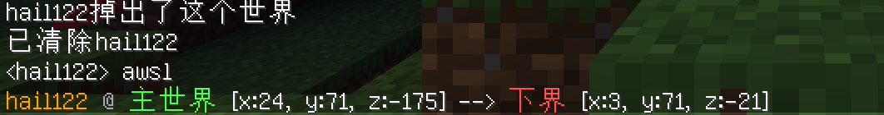

# WhoIsDied-Plugin  

A MCDR died pos plugin  \ 一个死亡广播插件  

Works with **MCDR1.x** & **minecraft_data_api**

When the player dies, this plugin will disclose your death pos.  

If you're using VoxelMap, you can click the pos and highlight it.

***  

需要 **MCDR1.x** 和 **Minecraft_data_api** 才可以正常运行  

当玩家狗带时，此插件会广播死亡坐标  

如果你使用体素地图，可以直接单击高亮坐标  

#### made with linstar and his firends
